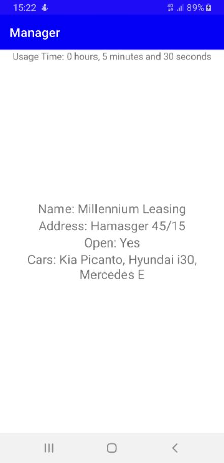
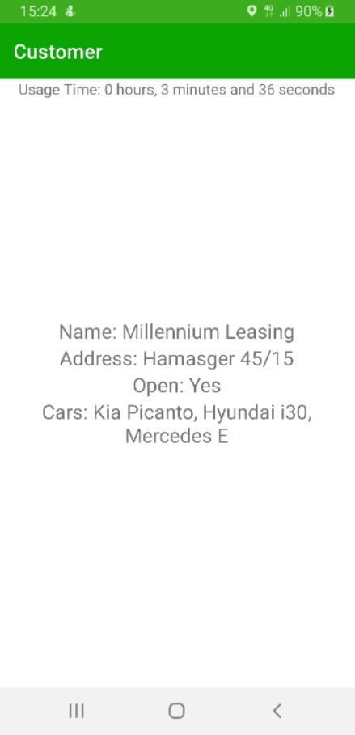

# MultiAppProject
MultiAppProject includes two applications that share a common module that pulls information from the server with Retrofit library and calculates usage time with the help of Room library.
  

